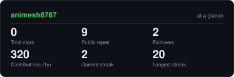
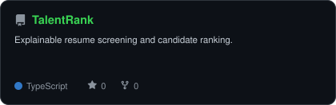
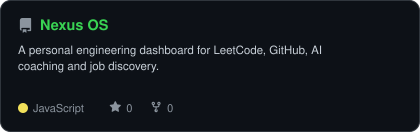
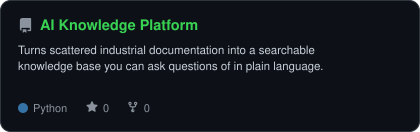
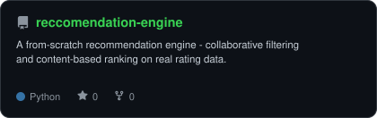

<div align="center">

<!-- PORTRAIT — generated by scripts/dotify.py from a background-cut copy of
     photo.jpeg. Colour dots on an opaque panel, so one file reads on both
     GitHub themes (a white shirt on a white page vanishes without the panel).
     Regenerate:
       python scripts/prep_photo.py photo.jpeg          # -> me-cutout.png
       python scripts/dotify.py me-cutout.png -o assets/portrait \
         --cols 100 --equalize --detail 0.5 --color --bg "#0d1117" --reveal -->


<br>

<!-- NAME / TAGLINE — animated typing -->
<a href="https://github.com/animesh8787">
  
</a>

<br>

<!-- SOCIALS -->
<a href="https://linkedin.com/in/animesh-dhiman-658250311"></a>
<a href="mailto:workreachoutanimesh@gmail.com"></a>
<a href="https://animeshdhiman.dev"></a>
<a href="https://leetcode.com/"></a>


</div>

---

## `~/` whoami

```console
$ cat about.txt
```

Hi, I'm **Animesh** — a Final year CS student who spends most of the time at the
machine-learning and data end of things, and the rest building web tools to sit
on top of them.

- Currently building **[TalentRank](https://frontend-lake-phi-56.vercel.app)** — explainable resume screening, FastAPI + React
- Also running **[nexus-os](https://animesh8787.github.io/nexus-os)**, a personal engineering dashboard
- Portfolio: **[animeshdhiman.dev](https://animeshdhiman.dev)**
- Learning **ML systems**, and how to ship a FastAPI/React app end to end

<br>

<div align="center">

## `~/` toolbox

<!-- Full list of icon names: https://skillicons.dev -->


</div>

---

<div align="center">

## `~/` skill radar

<!-- Two radars, stacked so the labels stay readable on a phone.
     Self-rated one: edit assets/skills.json, the workflow redraws it. -->
<picture>
  <source media="(prefers-color-scheme: dark)"  srcset="assets/radar-dark.svg">
  <source media="(prefers-color-scheme: light)" srcset="assets/radar-light.svg">
  
</picture>

<sub>how I'd rate myself</sub>

<br><br>

<!-- Live radar built from real language byte counts across the repos -->
<picture>
  <source media="(prefers-color-scheme: dark)"  srcset="assets/radar-langs-dark.svg">
  <source media="(prefers-color-scheme: light)" srcset="assets/radar-langs-light.svg">
  
</picture>

<sub>what the bytes in my repos actually say</sub>

</div>

---

<div align="center">

## `~/` contribution calendar

<!-- 3D isometric calendar, regenerated every 6h by .github/workflows/metrics.yml -->


<br><br>

<!-- Snake eats the contribution graph — .github/workflows/snake.yml.
     404s until the Snake workflow has run once; that's expected. -->
<picture>
  <source media="(prefers-color-scheme: dark)"  srcset="https://raw.githubusercontent.com/animesh8787/animesh8787/output/snake-dark.svg">
  <source media="(prefers-color-scheme: light)" srcset="https://raw.githubusercontent.com/animesh8787/animesh8787/output/snake.svg">
  
</picture>

</div>

---

<div align="center">

## `~/` the numbers

<!-- Generated by scripts/cards.py into this repo — deliberately NOT
     github-readme-stats / streak-stats / github-profile-trophy, which are
     shared public instances that go down and take the section with them. -->
<picture>
  <source media="(prefers-color-scheme: dark)"  srcset="assets/card-stats-dark.svg">
  <source media="(prefers-color-scheme: light)" srcset="assets/card-stats-light.svg">
  
</picture>

<br>


</div>

---

<div align="center">

## `~/` selected work

<!-- Cards generated by scripts/cards.py from assets/projects.json. Stars,
     forks and language come live from the API on every run. Stacked one per
     row so the card text stays legible on a phone. -->
<a href="https://github.com/animesh8787/TalentRank">
  <picture>
    <source media="(prefers-color-scheme: dark)"  srcset="assets/card-TalentRank-dark.svg">
    <source media="(prefers-color-scheme: light)" srcset="assets/card-TalentRank-light.svg">
    
  </picture>
</a>

<a href="https://github.com/animesh8787/nexus-os">
  <picture>
    <source media="(prefers-color-scheme: dark)"  srcset="assets/card-nexus-os-dark.svg">
    <source media="(prefers-color-scheme: light)" srcset="assets/card-nexus-os-light.svg">
    
  </picture>
</a>

<a href="https://github.com/animesh8787/AI-powered-Industrial-Knowledge-Intelligence-Platform">
  <picture>
    <source media="(prefers-color-scheme: dark)"  srcset="assets/card-AI-powered-Industrial-Knowledge-Intelligence-Platform-dark.svg">
    <source media="(prefers-color-scheme: light)" srcset="assets/card-AI-powered-Industrial-Knowledge-Intelligence-Platform-light.svg">
    
  </picture>
</a>

<a href="https://github.com/animesh8787/reccomendation-engine">
  <picture>
    <source media="(prefers-color-scheme: dark)"  srcset="assets/card-reccomendation-engine-dark.svg">
    <source media="(prefers-color-scheme: light)" srcset="assets/card-reccomendation-engine-light.svg">
    
  </picture>
</a>

</div>

---

<div align="center">

<sub>Everything on this page is a file in this repo — the charts redraw themselves on a schedule.</sub>

</div>
